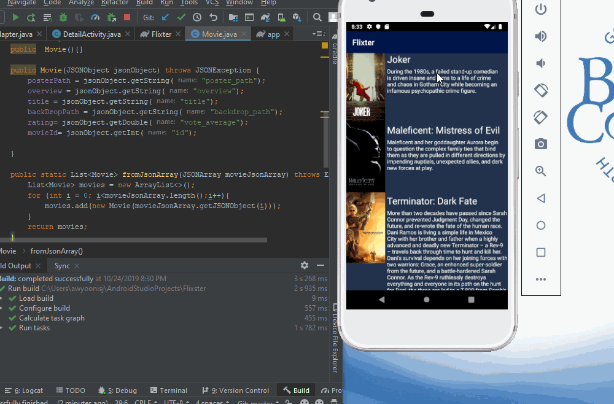

# *Flixter*

**Flixter** is an android app that allows the user to see all the movies that are currently playing and their descriptions.

Submitted by: **Jamal Aw Yonis**

Time spent: **4** hours spent in total

## User Stories

The following **required** functionality is completed:

* [x] User can view a list of movies (title, poster image, and overview) currently playing in theaters from the Movie Database API.

The following **optional** features are implemented:

* [x] Views should be responsive for both landscape/portrait mode. In portrait mode, the poster image, title, and movie overview is shown. In landscape mode, the rotated alternate layout should use the backdrop image instead and show the title and movie overview to the right of it.

* [x] Improve the user interface through styling and coloring

## Video Walkthrough

Here's a walkthrough of implemented user stories:

 

GIF created with [LiceCap](http://www.cockos.com/licecap/).
